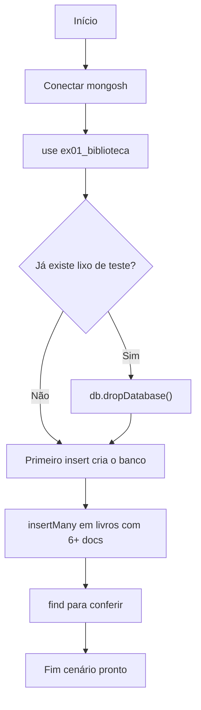
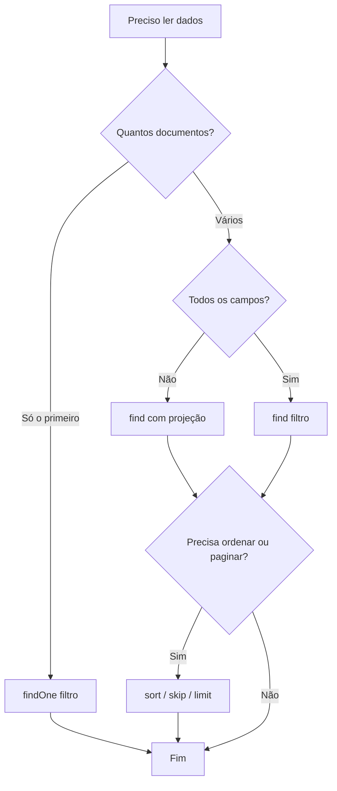
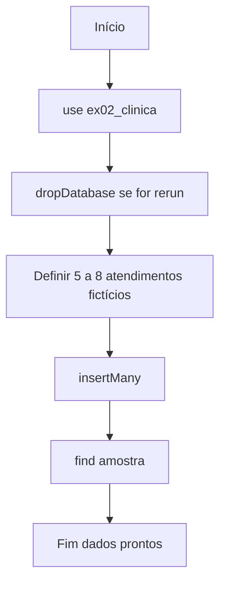
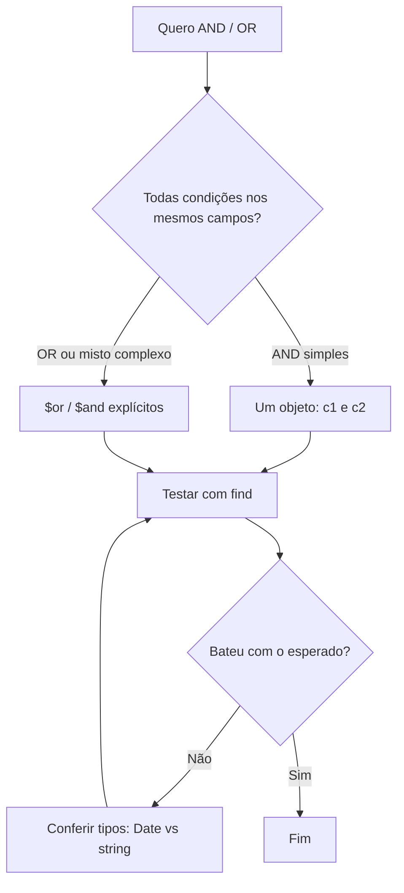
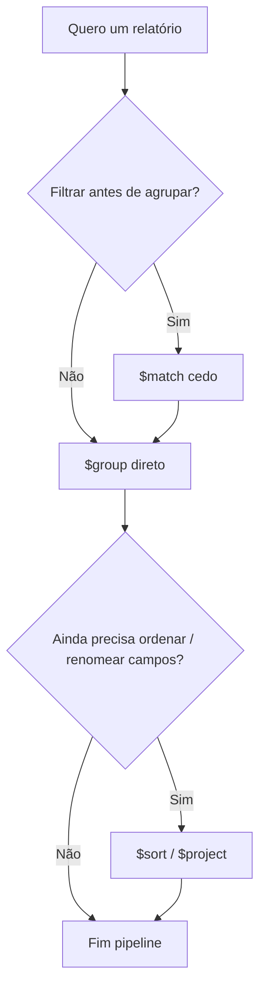
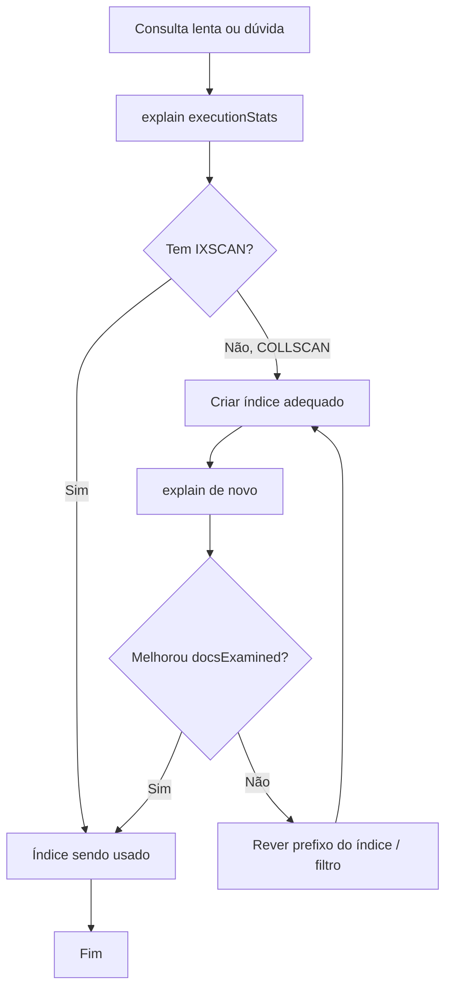

# Exercícios práticos (do zero) — com fluxogramas

[← Anterior: Erros comuns](11-erros-comuns.md) · [Índice](../README.md)

---

Objetivo: você **montar o cenário sozinho** no `mongosh`, seguindo o fluxo. Os fluxogramas são **mapas**; os detalhes de comando estão nos links da coluna “Material”.

**Regra de ouro:** use um banco dedicado por exercício (`use ex01_biblioteca`, `use ex02_clinica`, …) para poder apagar com `db.dropDatabase()` sem medo.

| Ex. | Tema | Consulte |
|-----|------|------------|
| 1 | Biblioteca mínima (dados + consultas) | [Banco/collections](01-banco-e-collections.md), [CRUD](02-crud-documentos.md), [Find](03-pesquisas-find.md) |
| 2 | Clínica (arrays, datas, filtros) | [Find](03-pesquisas-find.md), [Sandbox](07-sandbox-operadores-avancados.md) |
| 3 | Relatório com agregação | [Agregação](04-agregacao-e-lookup.md), [Avançada](08-agregacao-avancada.md) |
| 4 | Performance com índice | [Índices](05-indices.md), [Extras](09-indices-extras-e-utilitarios.md) |

---

## Exercício 1 — Biblioteca do zero

**Meta:** banco `ex01_biblioteca`, collection `livros`, pelo menos **6** livros com: `titulo`, `autor`, `ano`, `genero` (string ou array), `emprestado` (boolean).

### Fluxograma — criar o cenário

### Tarefas (checklist)

- [ ] Criar banco e collection implicitamente com `insertMany`.
- [ ] Listar todos com `find().pretty()`.
- [ ] Buscar livros com `ano >= 2020`.
- [ ] Buscar por `genero` usando `$in` (ex.: ficção ou fantasia).
- [ ] Atualizar um livro para `emprestado: true` com `updateOne`.
- [ ] Contar quantos estão emprestados com `countDocuments`.

### Fluxograma — decidir qual comando de leitura usar

---

## Exercício 2 — Clínica: consultas em cima de documentos “ricos”

**Meta:** banco `ex02_clinica`, collection `atendimentos`, cada documento com: `paciente`, `data` (`ISODate`), `sintomas` (array de strings), `observacoes` (opcional).

### Fluxograma — modelar e inserir

### Tarefas

- [ ] Inserir atendimentos com **datas diferentes** no mesmo mês.
- [ ] `find` com intervalo de datas (`$gte` / `$lte` em `data`).
- [ ] `find` onde `sintomas` contém **exatamente** dois itens (`$size: 2`) *ou* contém a string `"febre"` (contém elemento).
- [ ] `distinct` nos nomes de `paciente` com filtro (ex.: só quem tem certo sintoma).

### Fluxograma — montar filtro com lógica

---

## Exercício 3 — Relatório: pipeline de agregação

**Meta:** no banco `ex03_vendas`, collection `vendas` com: `vendedor`, `regiao`, `valor`, `data`.

### Fluxograma — desenhar o pipeline

### Tarefas

- [ ] Inserir pelo menos **10** vendas com 2+ vendedores e 2+ regiões.
- [ ] Pipeline: **total de `valor` por `vendedor`**, ordenado do maior para o menor.
- [ ] Segundo pipeline (ou `$facet`): **média de valor por `regiao`**.
- [ ] (Opcional) `$lookup` com collection `metas` (uma meta por vendedor) e juntar no resultado.

Material: [Agregação básica](04-agregacao-e-lookup.md), [Avançada](08-agregacao-avancada.md).

---

## Exercício 4 — Índice e `explain`

**Meta:** banco `ex04_perf`, collection `pedidos` com muitos documentos (vários `insertMany`, importação com `mongoimport`, ou dados de exemplo no **Compass**).

### Fluxograma — investigar performance

### Tarefas

- [ ] Criar **100+** documentos (mínimo) com campo `clienteId` e `criadoEm`.
- [ ] Rodar `find({ clienteId: "X" }).sort({ criadoEm: -1 }).limit(5)` com `explain("executionStats")` **antes** de índice.
- [ ] Criar índice composto `{ clienteId: 1, criadoEm: -1 }`.
- [ ] Rodar o mesmo `explain` e comparar `executionStats.totalDocsExamined`.

Material: [Índices](05-indices.md), [Erros comuns](11-erros-comuns.md).

---

## Volume de dados para o exercício 4 (opcional)

Sem programar fora do MongoDB:

1. **`insertMany` repetido** — após `use ex04_perf`, rode vários blocos `db.pedidos.insertMany([...])` com dezenas de documentos (pode copiar/colar e mudar `clienteId` / datas).
2. **`mongoimport`** — importe um JSON com muitas linhas (ver [Índices extras e utilitários](09-indices-extras-e-utilitarios.md)).
3. **Compass** — coleção vazia → “Add Data” → importar CSV/JSON.

---

## Critérios de “concluído”

Você terminou bem um exercício quando consegue:

1. **Recriar** o banco do zero sem olhar o material (só o fluxograma).
2. Explicar em uma frase **por que** cada `find` ou estágio do `$match` retorna aquele conjunto.
3. Em exercícios 3 e 4, mostrar o **resultado** do `explain` ou do `aggregate` a outra pessoa.

---

## Onde pedir ajuda

- [Erros comuns](11-erros-comuns.md)
- [Referência rápida](06-guia-referencia-rapida.md)
- [README principal](../README.md) (tabela de documentos)
